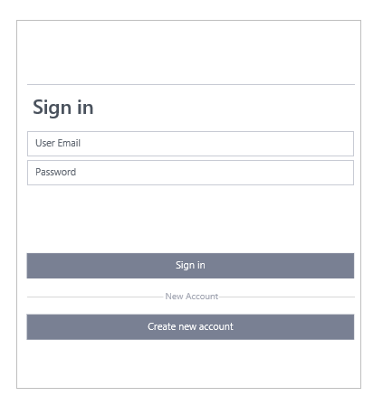
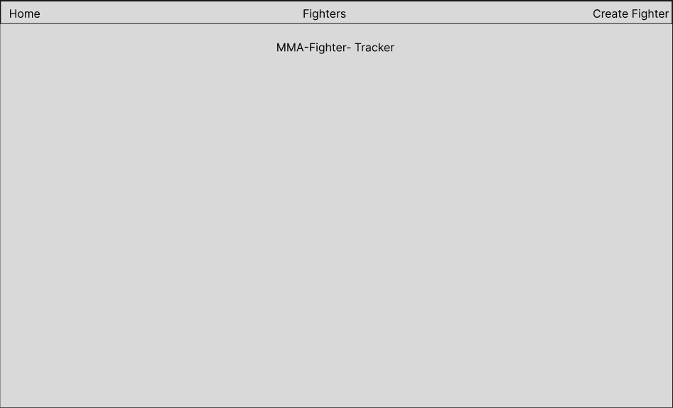
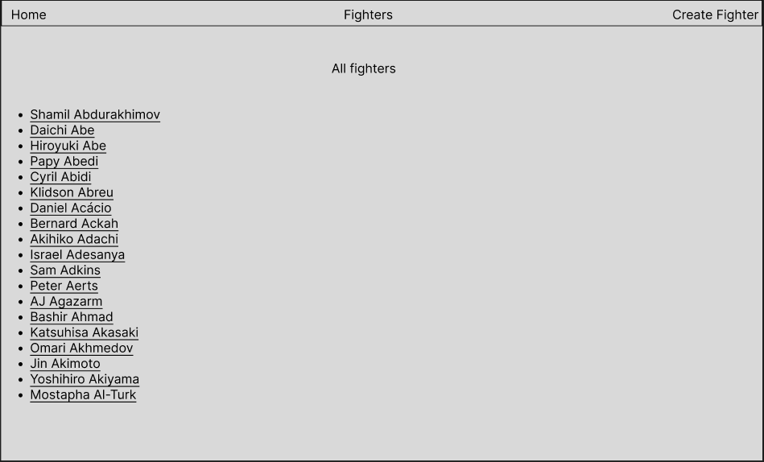
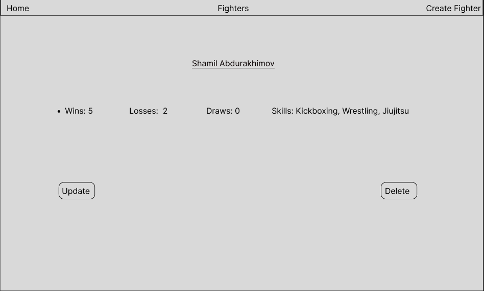
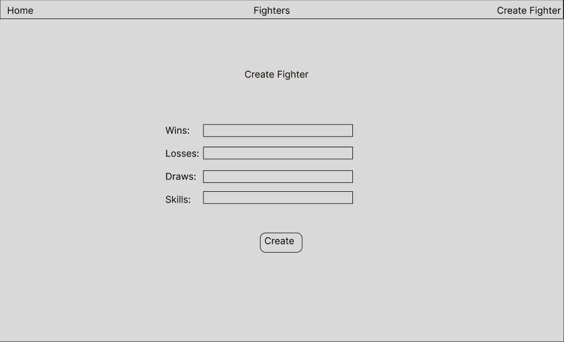
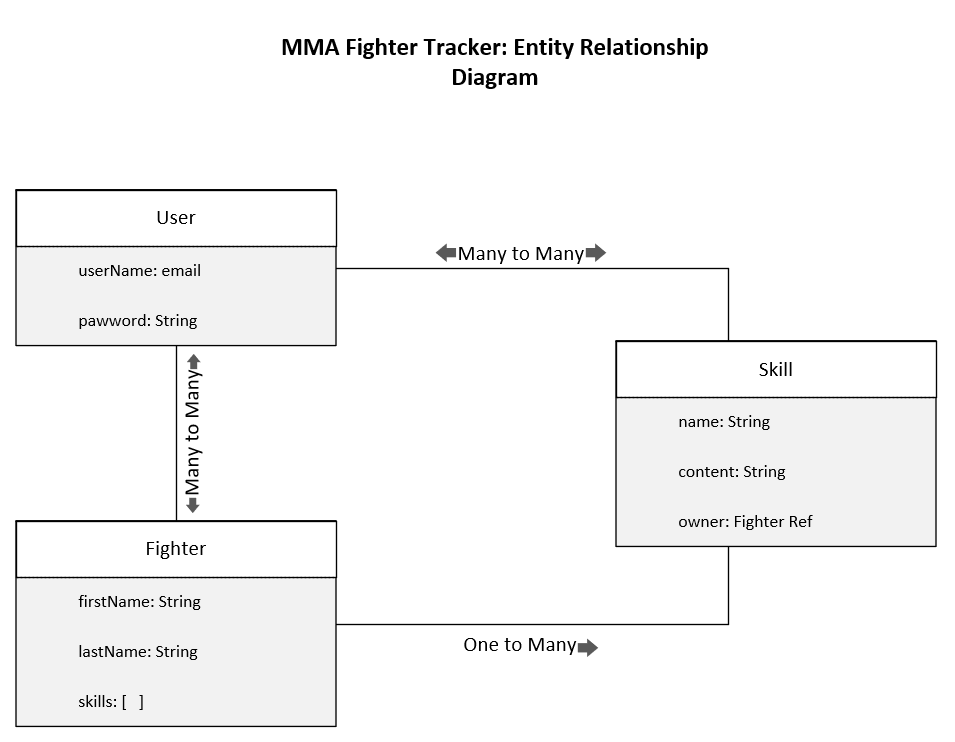

# MMA-Fighter-Tracker-CRUD
MMA Fighter Tracker APP: A simple crud app to track MMA fighters' orifessuional records. 
_________________________________________________________________
## This Readme will include the following:
* A project wireframe showing what the game will look like.
* MVP User Stories
* Pseudo Code For Each MVP User Story
* V2 User Stories
* V3 User Stories

## Wireframe:

This is what the app will look like:

### Login Page:

### Landing Page:

### Index Page:

### Individual Entity

### Create Entity Form

## Entity Relationship Diagram:

Below is the entity relationship diagram for the app:

_________________________________________________________________
## MVP User Stories
* As a user, I want to see a login page when I open the app.
* As a user, I want to log in and out.
* As a user, I want to see all current fighters registered on the app.
* As a user, I want to add new fighters to the app.
* As a user, I want to update fighter information.
* As a user, I want to delete fighter information.
_________________________________________________________________
## Pseudo Code for MVP User Stories

### As a user, I want to see a 4X4 grid of clickable cards.
* Build an html landing page with credential fields for "username" & "password" and a login button that sends the credentials to the server.

### As a user, I want to log in and out.
* Build an auth.js file with passport, bcrypt and json web token. 
* Include a user model and route that uses bcrypt and the auth.js file.    

### As a user, I want to see all current fighters registered on the app.
* Add an index router to the figher-route file that shows a list of all fighters with a GET request

### As a user, I want to add new fighters to the app.
* Add a post router the figher-route file that allows the user to add new information via a POST request

### As a user, I want to update fighter information.
* Add a patch router the figher-route file that allows the user to add new information via a PATCH/UPDATE request

### As a user, I want to delete fighter information.
* Add a delete router the figher-route file that allows the user to delete information via a delete request

_________________________________________________________________
## V2 User Stories
* As I want the app to connect to a fighter database via API.
* As a user, I want to query fighters based on specific categories (e.g. win record, knockout, submissions, team, country etc.).
_________________________________________________________________
## V3 User Stories
* As a user, I want to access fight footage of specific fighters.
* As a user, I want to change the app's UI style from the settings.
_________________________________________________________________

The main entities in the app are Fighter, Skill and User.
Fighter has a one-to-many relationship with Skill, meaning one fighter can have multiple skills.
User has a one-to-many relationship with Notes, meaning one user can have multiple notes.
It would also be likely that there is a many-to-many relationship between Users and Fighters, as many users can create and track multiple fighters, and each fighter can be tracked by multiple users.
Note that these relationships are based on the code you provided, but it is possible that there are other entities and relationships in your app.