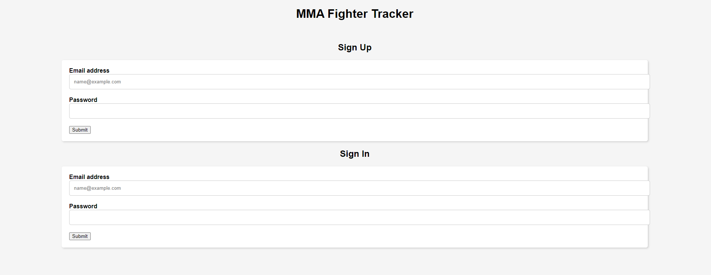
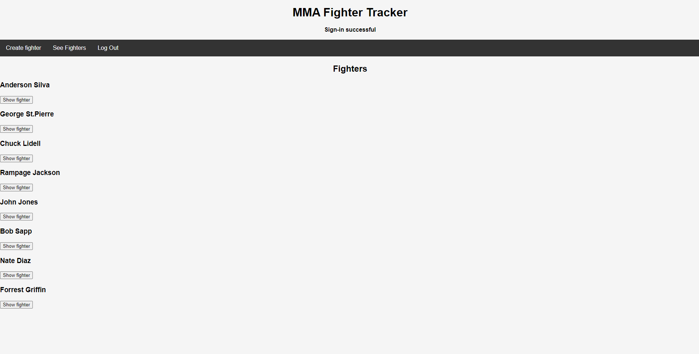
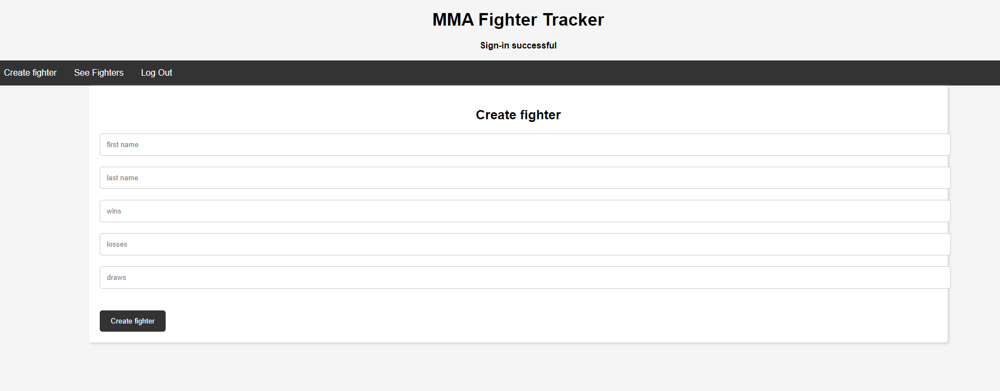
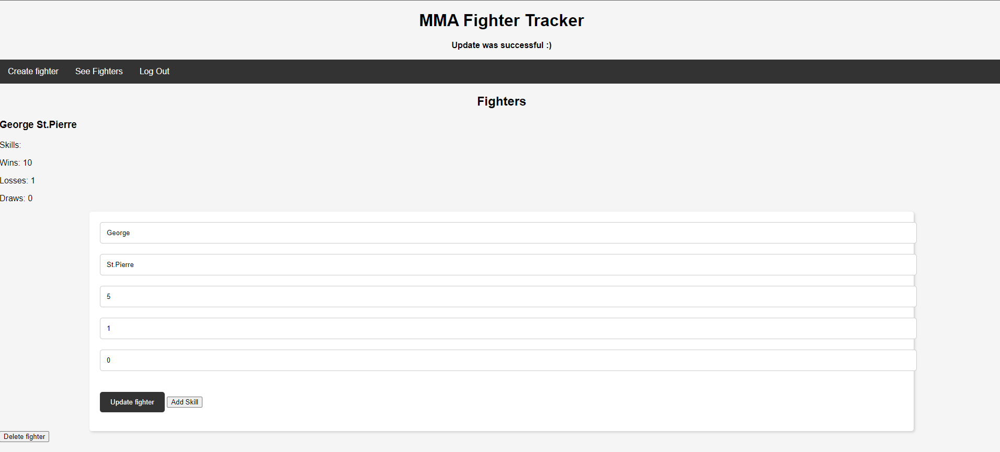
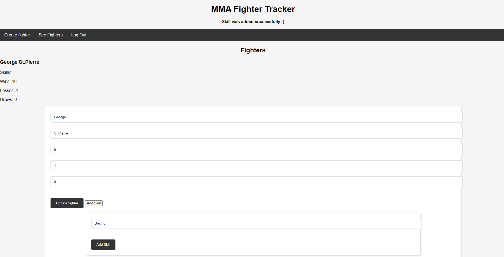

# CageWatch: Front-End
This repository is the front-end of CageWatch: A simple CRUD app to track MMA fighters' and their professional records.
Users can add new fighters, as well access, edit, and delete existing fighters. USers also have the option to add skills to existing fighters to match their professional record. 

## The repository for the app's server can be found [here](https://github.com/ThisisErm/CageWatch--Server)

_________________________________________________________________
## Technologies used:
* Javascript
* HTML
* CSS

_________________________________________________________________
## Screenshots:
This is what the app looks like:

_________________________________________________________________
## Getting Started

* create a user name and password. Then use it to log in. Once logged in, you will be able to access and modify fighter information.

_________________________________________________________________
## Next Steps
* As a user, I want the app to connect to a fighter database via API.
* As a user, I want to query fighters based on specific categories (e.g. win record, knockout, submissions, team, country etc.).
* As a user, I want to access fight footage of specific fighters.
* As a user, I want to change the app's UI style from the settings.
_________________________________________________________________
